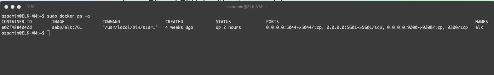

## Automated ELK Stack Deployment

The files in this repository were used to configure the network depicted below.

These files have been tested and used to generate a live ELK deployment on Azure. They can be used to either recreate the entire deployment pictured above. Alternatively, select portions of the playbook files may be used to install only certain pieces of it, such as Filebeat.

[first_playbook.yml](https://github.com/ryanhoedt/ELK-Stack/blob/main/Ansible/first_playbook.yml) installs and configures the DVWA virtual machines.

[install_elk.yml](https://github.com/ryanhoedt/ELK-Stack/blob/main/Ansible/install_elk.yml) installs and configures the ELK server container. 

[filebeat-playbook.yml](https://github.com/ryanhoedt/ELK-Stack/blob/main/Ansible/filebeat-playbook.yml) installs and configures Filebeat on the DVWA virtual machines.

[metricbeat-playbook.yml](https://github.com/ryanhoedt/ELK-Stack/blob/main/Ansible/metricbeat-playbook.yml) installs and configures Metricbeat on the DVWA virtual machines.

This document contains the following details:
- Description of the Topology
- Access Policies
- ELK Configuration
  - Beats in Use
  - Machines Being Monitored
- How to Use the Ansible Build

### Description of the Topology

The main purpose of this network is to expose a load-balanced and monitored instance of DVWA, the D*mn Vulnerable Web Application.

Load balancing ensures that the application will be capable of handling a high level of traffic, distributing traffic between 3 web servers.  This ensures consistent availability, since no one server is overwhelmed. 
The jump box provides a single, restricted point of entry to the network, accessible only from the public IP address of the admin's computer via SSH.  Access to the virtual machines on the network is possible from the ansible container on the jump box.

Integrating an ELK server allows users to easily monitor the vulnerable VMs for changes to the services and system logs.
- 'Filebeat'collects and parses system logs from the server and forwards them to Elasticsearch and Logstash for indexing and Kibana for easy visualization.
- 'Metricbeat'records metrics and statistical data and services running on the server such as CPU usage, memory, file system, disk and network input/output statistics and allows them to be viewed in Kibana.

The configuration details of each machine may be found below:

| Name     | Function        | IP Address | Operating System     |
|----------|-----------------|------------|----------------------|
| Jump Box | Gateway         | 10.0.0.10  | Linux (ubuntu 18.04) |
| Web-1    | DVWA Web Server | 10.0.0.11  | Linux (ubuntu 18.04) |
| Web-2    | DVWA Web Server | 10.0.0.12  | Linux (ubuntu 18.04) |
| Web-3    | DVWA Web Server | 10.0.0.13  | Linux (ubuntu 18.04) |
| ELK-VM   | ELK Stack       | 10.1.0.4   | Linux (ubuntu 18.04) |

### Access Policies

The machines on the internal network are not exposed to the public Internet. 

Only the Jump Box machine can accept connections from the Internet. Access to this machine is only allowed from the following IP addresses:
97.122.185.50 (My personal computer's public IP address) 

Machines within the network can only be accessed by the Jump Box.
- The Jump Box has access to the Elk server through the ansible container via SSH 10.0.0.10

A summary of the access policies in place can be found in the table below.

| Name     | Publicly Accessible                                                      | Allowed IP Address                                        |
|----------|--------------------------------------------------------------------------|-----------------------------------------------------------|
| Jump Box | via SSH only                                                             | 97.122.185.50 (My personal computer's public IP address)  |
| Web-1    | No, but can access DVWA portal via HTTP at the Load Balancer's public IP | 97.122.185.50; 10.0.0.10 (Jump Box)                       |
| Web-2    | No, but can access DVWA portal via HTTP at the Load Balancer's public IP | 97.122.185.50; 10.0.0.10                                  |
| Web-3    | No, but can access DVWA portal via HTTP at the Load Balancer's public IP | 97.122.185.50; 10.0.0.10                                  |
| ELK-VM   | No, but can access Kibana portal via port 5601                           | 97.122.185.50; 10.0.0.10                                  |

### Elk Configuration

Ansible was used to automate configuration of the ELK machine. No configuration was performed manually, which is advantageous because...
- Ansible is fast.  Docker containers can be implemented quickly with a few lines of code to set up and deploy.
- Ansible is consistent.  By using playbook files, configurations can be written once and deployed as specified.  Changes to configuration are easily implemented in the playbook file.

The playbook implements the following tasks:
- Docker.io and python3-pip are installed.
- Docker module is intstalled via pip.
- Virtual memory is increased.
- Docker image sebp/elk:761 is downloaded and launched.
- Availabe ports are specified (5601, 9200, and 5044).

The following screenshot displays the result of running `docker ps` after successfully configuring the ELK instance.

### Target Machines & Beats
This ELK server is configured to monitor the following machines:
- Web-1 at 10.0.0.11
- Web-2 at 10.0.0.12
- Web-3 at 10.0.0.13

We have installed the following Beats on these machines:
- Filebeat
- Metricbeat

These Beats allow us to collect the following information from each machine:
- 'Filebeat'collects and parses system logs from the server and forwards them to Elasticsearch and Logstash for indexing and Kibana for easy visualization.
- 'Metricbeat'records metrics and statistical data and services running on the server such as CPU usage, memory, file system, disk and network input/output statistics and allows them to be viewed in Kibana.

### Using the Playbooks
In order to use the playbook, you will need to have an Ansible control node already configured. Assuming you have such a control node provisioned: 

SSH into the control node and follow the steps below:
- Copy the [filebeat-configuration.yml](https://github.com/ryanhoedt/ELK-Stack/blob/main/Ansible/filebeat-configuration.yml) file to /etc/ansible/files.
- Update line 1106 to include the IP address of your ELK server:

  - hosts: \["\<ELK server IP\>:9200"\]

- Update line 1805 to include the IP address of your ELK server:

  - hosts: \["\<ELK server IP\>:5601"\]

- Copy the [metricbeat-config.yml](https://github.com/ryanhoedt/ELK-Stack/blob/main/Ansible/metricbeat-config.yml) file to /etc/ansible/files.
- Update line 62 to include the IP address of your ELK server:

  - hosts: \["\<ELK server IP\>:5601"\]

- Update line 95 to include the IP address of your ELK server:

  - hosts: \["\<ELK server IP\>:9200"\]

- Copy the [hosts](https://github.com/ryanhoedt/ELK-Stack/blob/main/Ansible/hosts) file to /etc/ansible.
- Update the hosts lines to include the group name and IP addresses of your web servers and ELK server:

  - \[webservers\]

  - \<Web server IP\> ansible_python_interpreter=/usr/bin/python3

  - \<Web server IP\> ansible_python_interpreter=/usr/bin/python3

  - \<Web server IP\> ansible_python_interpreter=/usr/bin/python3

  - \[elk\]

  - \<ELK server IP\> ansible_python_interpreter=/usr/bin/python3

- Copy the [filebeat-playbook.yml](https://github.com/ryanhoedt/ELK-Stack/blob/main/Ansible/filebeat-playbook.yml) file to /etc/ansible/files.
- Update the filebeat-playbook.yml file to include the name of your host group on line 3 (webservers, in this case).
- Copy the [metricbeat-playbook.yml](https://github.com/ryanhoedt/ELK-Stack/blob/main/Ansible/metricbeat-playbook.yml) file to /etc/ansible/files.
- Update the metricbeat-playbook.yml file to the name of your host group on line 3 (webservers, in this case).
- Run the playbook and navigate to http://<ELK-VM Public IP address>:5601/app/kibana to check that the installation worked as expected.

